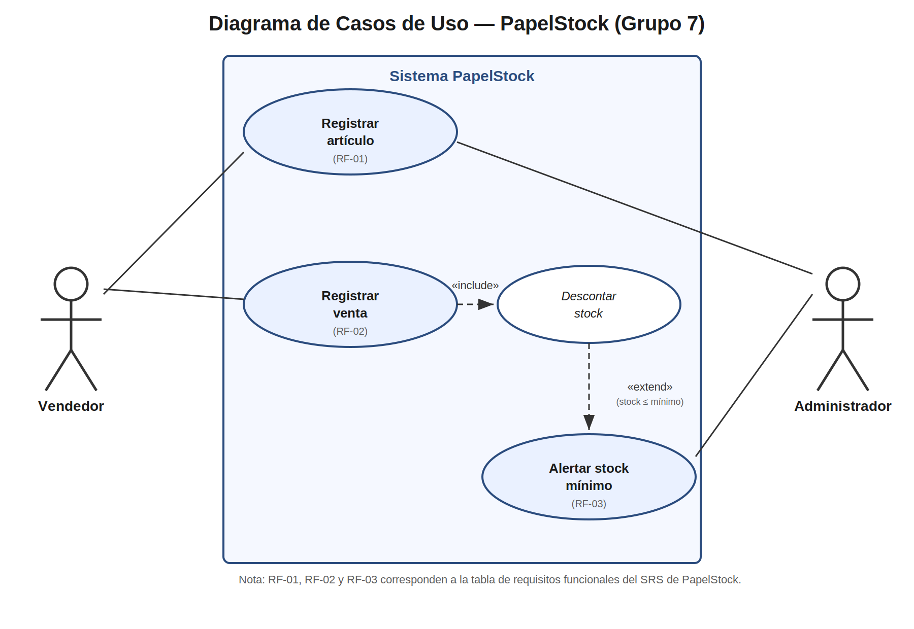
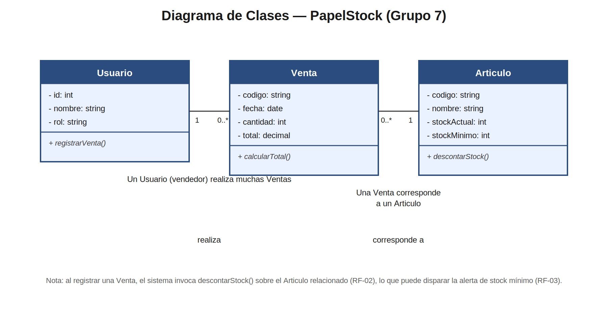

# PapelStock

Sistema simple de inventario para una papelería, desarrollado como proyecto integrador de la Semana 15 (Ingeniería de Software I — Universidad Agraria del Ecuador).

**Descripción:** PapelStock permite a un administrador registrar los artículos de la papelería con su stock, y a un vendedor registrar las ventas que se realizan. El sistema descuenta el stock automáticamente con cada venta y alerta al administrador cuando un artículo llega a su stock mínimo.

**Alcance:** el sistema NO gestiona compras a proveedores ni facturación electrónica; solo registro de artículos, ventas y alertas de stock.

## Integrantes del grupo (Grupo 7)

| Integrante | Rol en el proyecto |
|---|---|
| Rodolfo | Responsable de UML / repositorio |
| Rubén Noboa | Responsable de SRS |
| Mayra Buñay | Responsable de prototipo (Figma) |
| Madeline Núñez | Responsable de revisión general |

## Artefactos

- **SRS:** [enlace al documento](./docs/SRS-PapelStock.pdf)
- **Diagramas UML:** [carpeta /uml](./uml)
- **Prototipo Figma:** [enlace público de Figma](https://figma.com/TU-ENLACE-AQUI)

## Diagramas UML

### Diagrama de casos de uso

### Diagrama de clases

## Trazabilidad (Requisito → Caso de uso → Pantalla → Commit)

| Requisito | Caso de uso | Pantalla Figma | Commit |
|---|---|---|---|
| RF-01 | Registrar artículo | Pantalla 1: formulario de nuevo artículo | feat: SRS y README inicial (RF-01) |
| RF-02 | Registrar venta | Pantalla 2: selector de artículo + cantidad | docs: diagrama de casos de uso (RF-01 a RF-03) |
| RF-03 | Consultar stock / Alerta automática | Pantalla 3: vista con alerta de stock mínimo | feat: prototipo Figma 3 pantallas |

## Requisitos funcionales (resumen del SRS)

| Código | Descripción | Prioridad |
|---|---|---|
| RF-01 | El administrador registra un nuevo artículo con su stock inicial y stock mínimo. | Alta |
| RF-02 | El vendedor registra una venta de un artículo, y el sistema descuenta el stock automáticamente. | Alta |
| RF-03 | El sistema alerta al administrador cuando el stock de un artículo llega al mínimo. | Media |
| RNF-01 | El registro de una venta debe completarse en un máximo de 3 pantallas (usabilidad). | Media |
